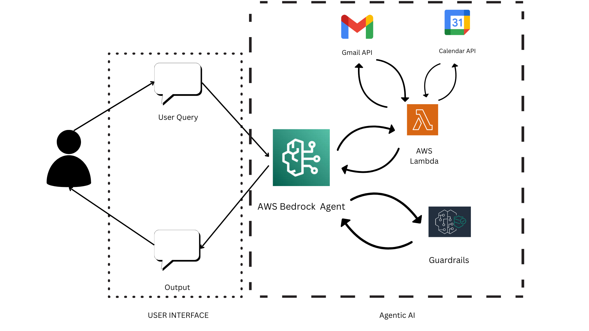

# 🚀 InnovationHacks2025 – AI Productivity Assistant

An intelligent virtual assistant built with **AWS Bedrock Agents**, **Lambda**, and **Google Workspace APIs (Gmail + Calendar)** to help users manage tasks, schedule meetings, and stay productive — all through natural language.

---

## 🧠 Features

- 📅 **Smart Scheduling** – Create and view Google Calendar events
- 📧 **Email Automation** – Read, prioritize, and send Gmail messages
- 🔍 **Context Awareness** – Interprets phrases like “tomorrow at 9 AM”
- 🤖 **Conversational Agent** – Engages with users and asks helpful follow-up questions
- ⏰ **Time-Sensitive Logic** – Automatically adjusts for user timezones (default: UTC-7)

---

## 🏗️ Architecture

- **AWS Lambda** triggers business logic
- **Bedrock Agents** handle natural language and reasoning
- **Action Groups** connect Bedrock to:
  - 📧 Gmail API (`read_gmail`, `send_gmail`)
  - 📅 Google Calendar API (`read_calendar`, `create_calendar_event`)

---

## 🛠️ Tech Stack

- Python (Google API client)
- AWS Bedrock Agents
- Google Calendar + Gmail API
- Lambda for secure execution

---

## 💡 Example Prompts

- “What do I need to do today?”
- “Send a follow-up email to Jane.”
- “Schedule a meeting for tomorrow at 10 AM with the team.”
- “Check if I’m free this Thursday at 2 PM.”

---
